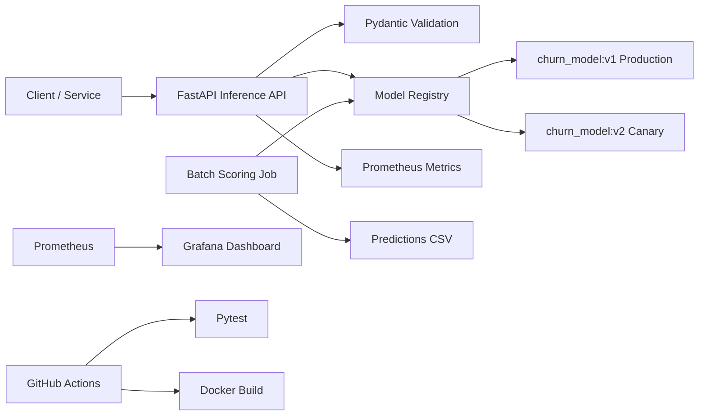

# ML Inference Platform Lab

## Overview

ML Inference Platform Lab is a production-style MLOps demo for a Customer Churn Prediction Platform. It serves churn predictions through FastAPI, supports batch scoring, tracks model versions, simulates canary routing, exposes Prometheus metrics, includes drift checks, and ships with Docker, Docker Compose, tests, and GitHub Actions.

## Why This Project?

Many ML portfolio projects stop at notebook training. This repository demonstrates the platform work around a model: reliable APIs, typed contracts, model registry behavior, deployment packaging, observability, batch workflows, validation, and automated checks. It is designed for MLOps Engineer, ML Platform Engineer, and Analytics Platform Engineer portfolios.

## Architecture



## Features

- Real-time `/predict` endpoint with request IDs, latency tracking, structured logs, and risk labels.
- `/predict/canary` endpoint routing traffic between production and canary model versions.
- JSON model registry with artifact loading through Joblib.
- Synthetic training script that creates two scikit-learn artifacts.
- Batch CSV scoring with schema validation, retries, output validation, and metrics.
- Prometheus metrics for request counts, latency, prediction distribution, model version traffic, batch volume, and drift score.
- Simple drift detection endpoint for feature mean shift.
- Docker Compose stack with API, Prometheus, and Grafana.
- GitHub Actions CI for dependency install, training, linting, tests, and Docker build.

## Tech Stack

Python 3.11, FastAPI, Pydantic, scikit-learn, Pandas, NumPy, Joblib, Prometheus Client, Docker, Docker Compose, Pytest, Ruff, Loguru, and GitHub Actions.

## Real-Time Inference API

`POST /predict` accepts customer features and returns:

```json
{
  "request_id": "abc-123",
  "prediction": 1,
  "churn_probability": 0.82,
  "risk_level": "high",
  "model_name": "churn_model",
  "model_version": "v1",
  "latency_ms": 12.4
}
```

Optional `model_version` can be provided to score with a specific model version. Without it, the production model from `models/model_registry.json` is used.

## Batch Scoring Pipeline

The batch pipeline reads CSV records, validates each row with the same Pydantic contract, loads the production model, scores all records, and writes predictions to `batch/output/predictions.csv`.

## Model Registry & Versioning

`models/model_registry.json` defines model metadata, stages, artifact paths, framework, creation date, and descriptions. `ModelRegistry` loads artifacts, returns the production model, retrieves a specific version, and reports loaded models.

## Canary Deployment Simulation

`POST /predict/canary` routes requests to `v1` or `v2`. The canary percentage is configured with `CANARY_PERCENTAGE` and defaults to 10, simulating a 90/10 production-to-canary rollout.

## Monitoring & Observability

`GET /metrics` exposes Prometheus metrics:

- `inference_request_total`
- `inference_error_total`
- `inference_latency_seconds`
- `prediction_distribution_total`
- `model_version_request_total`
- `batch_records_processed_total`
- `drift_score`

## Drift Detection

`POST /drift/check` compares incoming records with baseline feature statistics and returns a drift score plus features whose normalized mean shift crosses the configured threshold.

## CI/CD

GitHub Actions runs on push and pull request to `main`. The workflow installs dependencies, trains demo artifacts, runs Ruff, executes tests, and builds the Docker image.

## How To Run

```bash
make install
make train
make test
make run
```

The API runs at `http://localhost:8000`.

With Docker Compose:

```bash
docker compose up --build
```

Services:

- API: `http://localhost:8000`
- Prometheus: `http://localhost:9090`
- Grafana: `http://localhost:3000` with `admin/admin`

## Example Requests

```bash
curl -X POST http://localhost:8000/predict \
  -H "Content-Type: application/json" \
  -d '{
    "customer_age": 32,
    "tenure_months": 14,
    "monthly_spend": 79.5,
    "num_support_tickets": 3,
    "contract_type": "monthly",
    "payment_delay_days": 8,
    "usage_frequency": 12
  }'
```

Canary:

```bash
curl -X POST http://localhost:8000/predict/canary \
  -H "Content-Type: application/json" \
  -d @batch/sample_input.json
```

## Example Batch Command

```bash
python batch/batch_score.py --input batch/sample_input.csv --output batch/output/predictions.csv
```

Or:

```bash
make batch
```

## Metrics

Prometheus scrapes the API on `/metrics`. Grafana can use the included dashboard JSON as a starting point for request volume, latency, routing split, error rate, and drift monitoring.

## Production Considerations

For real deployments, this local lab would typically be extended with Kubernetes, autoscaling, a managed model registry, object storage, API authentication, rate limits, structured audit logs, and production drift windows.

## Future Improvements

- Add MLflow model registry integration.
- Add OpenTelemetry traces.
- Add feature store read paths.
- Add shadow deployment mode.
- Add load tests and SLO-based alerts.
- Add Grafana provisioning for the dashboard.

